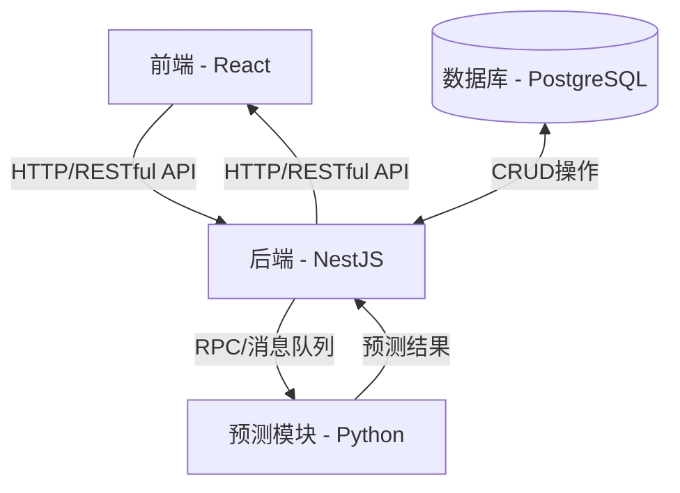

# 物流园区碳排放预测和管理系统

## 项目概述
本项目是一个综合性的物流园区碳排放预测和管理系统，旨在帮助物流企业监控、分析和减少碳排放，实现可持续发展目标。系统采用前后端分离架构，结合机器学习模型进行碳排放预测分析。

## 系统架构
系统由三个主要组件构成：


### 技术栈概览
- 前端：React、TypeScript、Ant Design、Echarts
- 后端：NestJS、TypeScript、PostgreSQL、TypeORM
- 预测模块：Python、Flask、Scikit-learn、TensorFlow
- 部署：Docker、Docker Compose

### 组件说明
#### [前端架构设计文档](./frontend/README.md)
前端基于React框架开发，提供直观的用户界面，包括用户认证、设备管理、数据展示、报表分析及预测结果可视化等功能。
主要特点：
 - 响应式设计，适配多种设备
 - 实时数据展示和分析图表
 - 主题定制和多语言支持
 - 用户权限管理

#### [后端架构设计文档](./backend/README.md)
后端使用NestJS框架开发，提供RESTful API接口，实现业务逻辑处理，数据持久化和安全认证。

主要功能：
 - 用户认证与授权
 - 设备管理
 - 数据采集和处理
 - 碳排放计算
 - 与预测模块交互

#### [预测模块架构设计文档](./prediction/README.md)
基于Python开发的机器学习服务，根据历史数据和环境因素预测未来碳排放趋势。
主要特点：
 - 多种预测模型支持
 - 模型训练和评估
 - 与后端的实时数据交互
 - 预测结果可视化

## 开发指南

### 环境要求
- Node.js (v14+)
- Python (v3.8+)
- Docker 和 Docker Compose
- Git

### 快速开始

#### 1. 克隆仓库

```bash
git clone <repository-url>
cd <repository-name>
```

#### 2. 启动开发环境

```bash
# 启动所有服务（使用Docker Compose）
docker-compose -f docker-compose.dev.yml up -d
```

#### 3. 初始化数据库

在服务启动后，需要初始化数据库以创建必要的表和初始数据：

```bash
# 方法1：使用curl命令调用API
curl -X POST http://localhost:3000/health/db-init

# 方法2：通过浏览器访问
# 在浏览器中访问 http://localhost:3000/health/db-init

# 方法3：使用Docker命令
docker exec -it carbon-emission-backend curl -X POST http://localhost:3000/health/db-init
```

初始化成功后，您将收到成功消息，数据库将包含必要的表结构、初始用户和示例数据。

#### 4. 访问应用

启动并初始化完成后，您可以通过以下URL访问各个服务：

- **前端**：http://localhost:3001
- **后端API**：http://localhost:3000/api
- **后端API文档**：http://localhost:3000/api/docs
- **预测服务API**：http://localhost:8000
- **预测服务文档**：http://localhost:8000/docs
- **RabbitMQ管理界面**：http://localhost:15672 (用户名/密码: guest/guest)
- **PgAdmin界面**：http://localhost:5050 (用户名/密码: admin@admin.com/admin)

#### 5. 独立启动各服务（可选）

如果您需要单独启动各个服务，可以使用以下命令：

```bash
# 前端
cd frontend && npm install && npm start

# 后端
cd backend && npm install && npm run start:dev

# 预测模块
cd prediction && pip install -r requirements.txt && python main.py
```

### 项目结构

```
project-root/
├── .gitignore                # 全局Git忽略文件
├── docker-compose.yml        # 整体项目Docker配置
├── README.md                 # 本文档
├── frontend/                 # 前端项目目录
│   ├── .gitignore            # 前端Git忽略文件
│   ├── README.md             # 前端文档
│   └── ...                   # 前端源代码文件
├── backend/                  # 后端项目目录
│   ├── .gitignore            # 后端Git忽略文件
│   ├── README.md             # 后端文档
│   └── ...                   # 后端源代码文件
└── prediction/               # 预测模块目录
    ├── .gitignore            # 预测模块Git忽略文件
    ├── README.md             # 预测模块文档
    └── ...                   # 预测模块源代码文件
```

## 测试

每个组件都包含自己的测试套件：

- **前端**：Jest和React Testing Library
  ```bash
  cd frontend && npm test
  ```

- **后端**：Jest
  ```bash
  cd backend && npm test
  ```

- **预测模块**：Pytest
  ```bash
  cd prediction && pytest
  ```

## 部署

系统支持Docker容器化部署，对于完整系统部署，可使用项目根目录中的`docker-compose.yml`：

```bash
# 生产环境部署
docker-compose -f docker-compose.prod.yml up -d
```

## 故障排查指南

### 三服务启动问题排查

当前端、后端和预测服务同时启动时，可能会遇到各种问题。以下是排查步骤：

#### 1. 检查容器状态

首先，检查所有容器是否正常运行：

```bash
docker ps -a
```

这会显示所有容器的状态。如果有容器已退出，可以查看其退出代码和状态。

#### 2. 查看容器日志

对于出现问题的容器，查看其日志：

```bash
# 查看前端容器日志
docker logs carbon-emission-frontend

# 查看后端容器日志
docker logs carbon-emission-backend

# 查看预测服务容器日志
docker logs carbon-emission-prediction

# 实时查看日志（带-f选项）
docker logs -f carbon-emission-prediction
```

#### 3. 检查网络连接

验证容器间的网络通信是否正常：

```bash
# 查看所有Docker网络
docker network ls

# 检查网络详情，包括哪些容器已连接
docker network inspect carbon-network

# 进入容器测试网络连接
docker exec -it carbon-emission-backend ping postgres
docker exec -it carbon-emission-prediction ping rabbitmq
```

#### 4. 验证服务是否响应

通过curl命令测试服务API：

```bash
# 测试后端服务
docker exec -it carbon-emission-backend curl http://localhost:3000/health

# 测试预测服务
docker exec -it carbon-emission-prediction curl http://localhost:8000/health
```

#### 5. 检查依赖项和配置

确认环境变量、配置文件和依赖项是否正确：

```bash
# 查看容器环境变量
docker exec -it carbon-emission-prediction env

# 检查Python包依赖
docker exec -it carbon-emission-prediction pip list

# 检查Node.js依赖
docker exec -it carbon-emission-backend npm list
```

#### 6. 数据库初始化问题

如果遇到数据库相关错误：

```bash
# 检查数据库连接
docker exec -it carbon-emission-backend curl http://localhost:3000/health/db-check

# 尝试手动重新初始化数据库
docker exec -it carbon-emission-backend curl -X POST http://localhost:3000/health/db-init

# 检查数据库日志
docker logs carbon-emission-postgres
```

### 不停止服务进行修改

有时需要在不停止容器的情况下进行调试或修改，可以使用以下方法：

#### 1. 直接进入容器命令行

```bash
# 进入前端容器
docker exec -it carbon-emission-frontend sh

# 进入后端容器
docker exec -it carbon-emission-backend bash

# 进入预测服务容器
docker exec -it carbon-emission-prediction bash
```

#### 2. 在容器内修改文件

在容器内，可以使用常见的Linux命令行编辑器进行文件修改：

```bash
# 安装编辑器（如果容器内没有）
apt-get update && apt-get install -y nano vim

# 使用编辑器修改文件
nano /app/main.py
vim /app/config.py
```

#### 3. 热重载服务

对于支持热重载的服务，修改后可能自动生效。否则，需要手动重启服务：

```bash
# 在容器内重启Python应用（Flask/FastAPI）
pkill -f python && python main.py

# 在容器内重启Node.js应用
npm run dev
```

#### 4. 从宿主机直接修改挂载的卷

如果使用卷挂载，可以直接在宿主机上修改文件，变更会自动同步到容器：

```bash
# 在宿主机上编辑文件
code ./frontend/src/App.tsx
vim ./backend/src/main.ts
```

## Docker开发流程

### Docker在开发中的角色

使用Docker进行开发有多种模式，每种都有其优缺点：

#### 1. 本地开发 + Docker测试
- **流程**：在本地环境开发，使用Docker仅用于测试和确保一致性
- **优点**：开发体验好，IDE集成更方便，不需要进入容器
- **缺点**：可能存在"在我的机器上能运行"的问题
- **适用场景**：大多数前端开发，简单的后端项目

#### 2. 卷挂载开发模式
- **流程**：启动容器并挂载本地源代码目录，在本地编辑，容器内运行
- **优点**：保持本地编辑体验，同时确保运行环境一致性
- **缺点**：需要配置热重载，有时会有性能问题
- **适用场景**：需要特定运行环境的项目，如我们的预测服务

#### 3. 开发容器模式
- **流程**：使用VS Code的Dev Containers或类似工具，在容器内进行全面开发
- **优点**：完全一致的开发环境，团队协作更顺畅
- **缺点**：需要学习新工具，可能影响开发速度
- **适用场景**：复杂系统，多人协作项目

### 为什么在开发中使用Docker？

1. **环境一致性**：消除"在我的机器上能运行"的问题
2. **快速入门**：新团队成员只需克隆仓库并启动Docker，无需复杂配置
3. **隔离依赖**：避免全局依赖的版本冲突
4. **模拟生产环境**：开发环境可以更接近生产环境
5. **服务编排**：轻松管理多个相互依赖的服务

### 推荐的开发流程

对于本项目，推荐采用卷挂载开发模式：

1. **初始设置**：
   ```bash
   # 克隆项目
   git clone <repo>
   
   # 启动开发环境
   docker-compose -f docker-compose.dev.yml up -d
   
   # 初始化数据库
   curl -X POST http://localhost:3000/health/db-init
   ```

2. **前端开发**：
   - 在本地编辑前端代码，保存后热重载自动生效
   - 访问 http://localhost:3001 查看效果

3. **后端开发**：
   - 在本地编辑后端代码，保存后Nest.js热重载自动生效
   - 通过http://localhost:3000/api端点测试API

4. **预测服务开发**：
   - 在本地编辑Python代码，保存后FastAPI自动重载（开发模式）
   - 通过http://localhost:8000/docs测试API

5. **整体测试**：
   - 所有服务已在Docker中同时运行，可以测试完整功能

6. **调试**：
   - 使用工具（如VS Code）设置远程调试
   - 或使用docker exec进入容器进行调试

这种方式既保留了本地开发的便捷性，又确保了环境的一致性。

## 贡献指南

1. Fork本仓库
2. 创建特性分支 (`git checkout -b feature/amazing-feature`)
3. 提交更改 (`git commit -m 'Add some amazing feature'`)
4. 推送到分支 (`git push origin feature/amazing-feature`)
5. 创建Pull Request

## 许可证

本项目采用[MIT许可证](LICENSE)。

---
