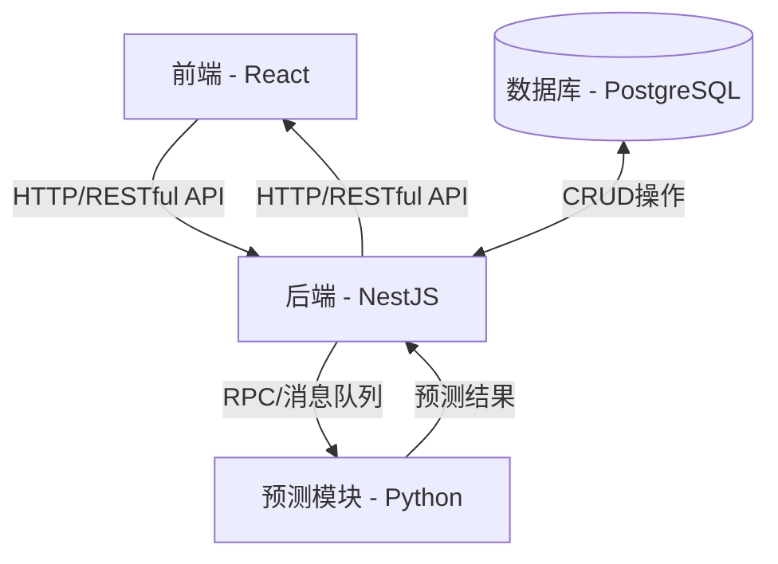

# 物流园区碳排放预测和管理系统 - 架构设计方案
# 项目初始化计划
## 系统整体架构
首先，让我们从系统整体架构开始，明确三个主要组件之间的交互关系：

```mermaid
graph TD
    A[前端 - React] -->|HTTP/RESTful API| B[后端 - NestJS]
    B -->|HTTP/RESTful API| A
    B -->|RPC/消息队列| C[预测模块 - Python]
    C -->|预测结果| B
    D[(数据库 - PostgreSQL)] <-->|CRUD操作| B
```

