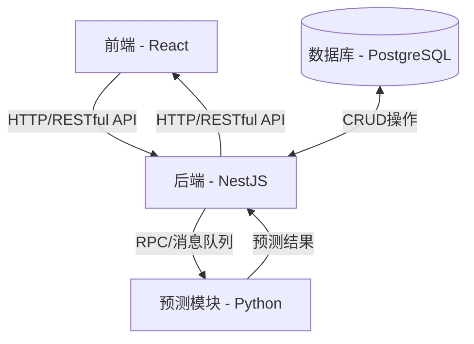

# 物流园区碳排放预测和管理系统

## 项目概述
本项目是一个综合性的物流园区碳排放预测和管理系统，旨在帮助物流企业监控、分析和减少碳排放，实现可持续发展目标。系统采用前后端分离架构，结合机器学习模型进行碳排放预测分析。

## 系统架构
系统由三个主要组件构成：


### 技术栈概览
- 前端：React、TypeScript、Ant Design、Echarts
- 后端：NestJS、TypeScript、PostgreSQL、TypeORM
- 预测模块：Python、Flask、Scikit-learn、TensorFlow
- 部署：Docker、Docker Compose

### 组件说明
- 前端 1
前端基于React框架开发，提供直观的用户界面，包括用户认证、设备管理、数据展示、报表分析及预测结果可视化等功能。
主要特点：
 - 响应式设计，适配多种设备
 - 实时数据展示和分析图表
 - 主题定制和多语言支持
 - 用户权限管理
- 后端 2
后端使用NestJS框架开发，提供RESTful API接口，实现业务逻辑处理，数据持久化和安全认证。
主要功能：
 - 用户认证与授权
 - 设备管理
 - 数据采集和处理
 - 碳排放计算
 - 与预测模块交互
- 预测模块 3
基于Python开发的机器学习服务，根据历史数据和环境因素预测未来碳排放趋势。
主要特点：
 - 多种预测模型支持
 - 模型训练和评估
 - 与后端的实时数据交互
 - 预测结果可视化

### 开发指南
- 环境要求
 - Node.js (v14+)
 - Python (v3.8+)
 - Docker 和 Docker Compose
 - Git
- 快速开始
1. 克隆仓库

```bash
git clone <repository-url>
cd <repository-name>
```
2. 启动开发环境

```bash
# 启动所有服务（使用Docker Compose）
docker-compose up -d

# 或分别启动各服务
# 前端
cd frontend && npm install && npm start

# 后端
cd backend && npm install && npm run dev

# 预测模块
cd prediction && pip install -r requirements.txt && python app.py
```

#### 项目结构

```
project-root/
├── .gitignore                # 全局Git忽略文件
├── docker-compose.yml        # 整体项目Docker配置
├── README.md                 # 本文档
├── frontend/                 # 前端项目目录
│   ├── .gitignore            # 前端Git忽略文件
│   ├── README.md             # 前端文档
│   └── ...                   # 前端源代码文件
├── backend/                  # 后端项目目录
│   ├── .gitignore            # 后端Git忽略文件
│   ├── README.md             # 后端文档
│   └── ...                   # 后端源代码文件
└── prediction/               # 预测模块目录
    ├── .gitignore            # 预测模块Git忽略文件
    ├── README.md             # 预测模块文档
    └── ...                   # 预测模块源代码文件
```

## 测试

每个组件都包含自己的测试套件：

- **前端**：Jest和React Testing Library
  ```bash
  cd frontend && npm test
  ```

- **后端**：Jest
  ```bash
  cd backend && npm test
  ```

- **预测模块**：Pytest
  ```bash
  cd prediction && pytest
  ```

## 部署

系统支持Docker容器化部署，详细部署指南请参考各组件的文档：

- [前端部署指南](./frontend/README.md#部署)
- [后端部署指南](./backend/README.md#部署)
- [预测模块部署指南](./prediction/README.md#部署)

对于完整系统部署，可使用项目根目录中的`docker-compose.yml`：

```bash
# 生产环境部署
docker-compose -f docker-compose.prod.yml up -d
```

## 贡献指南

1. Fork本仓库
2. 创建特性分支 (`git checkout -b feature/amazing-feature`)
3. 提交更改 (`git commit -m 'Add some amazing feature'`)
4. 推送到分支 (`git push origin feature/amazing-feature`)
5. 创建Pull Request

## 许可证

本项目采用[MIT许可证](LICENSE)。

---
