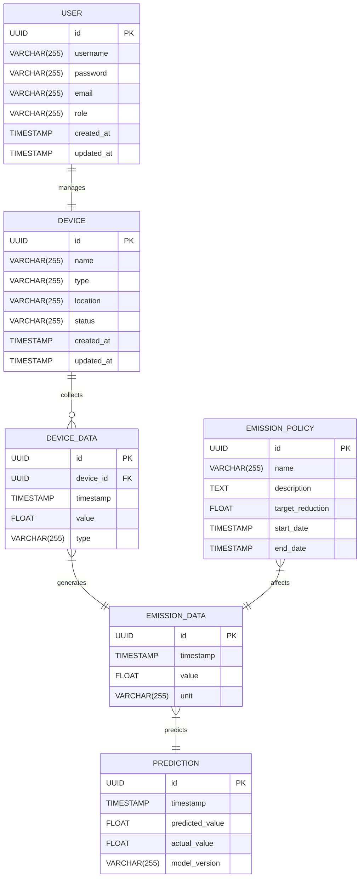

**物流园区碳排放预测和管理软件后端模块的架构设计文档**

**1. 概述**

1.  1 **项目目标**

*   构建一个稳定、可扩展、易维护的后端系统，用于支持物流园区碳排放的预测和管理。
*   提供清晰的 API 接口，方便前端 React 应用调用。
*   与 Python 预测模块集成，实现碳排放预测功能。
*   存储和管理碳排放相关数据，并提供数据分析和报表功能。

2.  2 **技术选型**

*   编程语言：TypeScript (NestJS)
*   框架：NestJS (基于 Node.js)
*   数据库：PostgreSQL
*   ORM：TypeORM
*   缓存：Redis
*   队列：RabbitMQ (或 Redis 队列)
*   认证授权：JWT (JSON Web Token)

3.  3 **架构原则**

*   **Clean Architecture (整洁架构)**：采用分层架构，将业务逻辑与基础设施解耦。
*   **SOLID 原则**：遵循单一职责原则、开闭原则、里氏替换原则、接口隔离原则和依赖倒置原则。
*   **微服务架构思想**：虽然初期可能是单体应用，但设计上要考虑未来拆分为微服务的可能性。
*   **RESTful API**：设计符合 RESTful 规范的 API 接口。
*   **可扩展性**：系统设计应考虑未来的扩展需求，例如支持更多类型的设备、更复杂的预测模型等。
*   **可维护性**：代码应具有良好的可读性、可测试性和可维护性。

**2. 模块划分**

后端系统主要划分为以下几个模块：

1.  1 **API Gateway 模块**

*   **功能**：
    *   统一入口：接收来自前端的所有请求，并路由到相应的模块。
    *   认证授权：验证用户的身份和权限。
    *   限流：防止恶意请求或流量过载。
    *   请求转发：将请求转发到相应的微服务或模块。
    *   聚合：将多个微服务或模块的响应合并为一个响应。
*   **技术选型**：
    *   `NestJS` + `NestJS/Passport` (认证) + `RateLimit` (限流)
*   **架构设计**
    *   采用 Nginx 反向代理 或者 Kong API 网关, 提供统一的入口, 转发到内部的各个模块
    *   Nginx 完成 SSL 卸载, 负载均衡, 静态资源服务
    *   Kong 提供 API 鉴权, 流量控制, 日志记录等功能

2.  2 **用户管理模块 (User Module)**

*   **功能**：
    *   用户注册、登录、注销
    *   用户角色管理 (例如：管理员、普通用户)
    *   用户权限管理
    *   密码管理 (修改密码、重置密码)
    *   用户资料管理
*   **数据流量**：
    *   接收来自前端的用户注册、登录等请求。
    *   与数据库交互，进行用户数据的增删改查操作。
    *   发送 JWT Token 给前端，用于后续的认证。
*   **API 接口**：
    *   `POST /auth/register`：用户注册
    *   `POST /auth/login`：用户登录
    *   `POST /auth/logout`：用户登出
    *   `GET /users/me`：获取当前用户信息 (需要认证)
    *   `PUT /users/me`：更新当前用户信息 (需要认证)
    *   `PUT /users/me/password`：修改当前用户密码 (需要认证)
    *   `GET /users/:id`：获取指定用户信息 (需要权限)
    *   `PUT /users/:id`：更新指定用户信息 (需要权限)
    *   `DELETE /users/:id`：删除指定用户信息 (需要权限)

3.  3 **设备管理模块 (Device Module)**

*   **功能**：
    *   设备注册和管理
    *   设备类型管理
    *   设备状态监控
    *   设备数据采集配置
*   **数据流量**：
    *   接收来自前端的设备管理请求。
    *   与数据库交互，进行设备数据的增删改查操作。
    *   接收来自设备的实时数据（可能通过 MQTT 或其他协议）。
*   **API 接口**：
    *   `POST /devices`：注册新设备
    *   `GET /devices`：获取所有设备列表
    *   `GET /devices/:id`：获取指定设备信息
    *   `PUT /devices/:id`：更新指定设备信息
    *   `DELETE /devices/:id`：删除指定设备
    *   `GET /devices/:id/data`：获取指定设备的历史数据
    *   `GET /devices/:id/status`：获取指定设备状态
    *   `POST /devices/:id/config`：配置设备数据采集

4.  4 **数据采集模块 (Data Collection Module)**

*   **功能**：
    *   负责收集来自各种设备、传感器的数据。
    *   数据验证和清洗。
    *   将数据存储到数据库。
    *   数据转换和格式化，适配预测模型。
*   **数据流量**：
    *   接收来自设备的实时数据（例如通过 MQTT、HTTP 等协议）。
    *   与数据库交互，存储采集到的数据。
    *   与 Python 预测模块交互，传递数据用于预测。
*   **架构设计**：
    *   可以使用消息队列 (例如 RabbitMQ) 作为缓冲，处理高并发的数据采集请求。
    *   使用专门的数据采集服务，例如 Telegraf 或 Node-RED。

5.  5 **碳排放预测模块 (Prediction Module)**

*   **功能**：
    *   调用 Python 预测服务，进行碳排放预测。
    *   管理预测模型。
    *   提供预测结果查询接口。
*   **数据流量**：
    *   接收来自数据采集模块的数据。
    *   向 Python 预测服务发送请求，获取预测结果。
    *   将预测结果存储到数据库。
*   **架构设计**：
    *   使用 RPC (Remote Procedure Call) 或消息队列与 Python 预测服务通信。
    *   Python 预测服务可以部署为独立的微服务。

6.  6 **碳排放管理模块 (Emission Management Module)**

*   **功能**：
    *   碳排放数据展示
    *   碳排放指标管理
    *   碳排放报表生成
    *   碳排放预警
    *   减排策略管理
*   **数据流量**：
    *   从数据库读取碳排放数据。
    *   生成报表数据。
    *   发送预警通知。
*   **API 接口**：
    *   `GET /emissions`：获取碳排放数据
    *   `GET /emissions/reports`：生成碳排放报表
    *   `GET /emissions/alerts`：获取碳排放预警
    *   `POST /emissions/policies`：创建减排策略
    *   `PUT /emissions/policies/:id`：更新减排策略
    *   `DELETE /emissions/policies/:id`：删除减排策略

**3. 模块间通信**

*   **API Gateway <-> 各模块**：HTTP/HTTPS (RESTful API)
*   **数据采集模块 <-> 消息队列**：AMQP (RabbitMQ) 或 Redis 队列
*   **碳排放预测模块 <-> Python 预测服务**：RPC (gRPC, Thrift) 或 消息队列

**4. 数据库设计**

**ER 图**



**表结构定义**

1.  **users (用户表)**

```sql
CREATE TABLE users (
  id UUID PRIMARY KEY DEFAULT gen_random_uuid(),
  username VARCHAR(255) UNIQUE NOT NULL,
  password VARCHAR(255) NOT NULL,
  email VARCHAR(255) UNIQUE NOT NULL,
  role VARCHAR(255) NOT NULL DEFAULT 'user', --  例如：admin, user
  created_at TIMESTAMP WITH TIME ZONE DEFAULT NOW(),
  updated_at TIMESTAMP WITH TIME ZONE DEFAULT NOW()
);
```

2.  **devices (设备表)**

```sql
CREATE TABLE devices (
  id UUID PRIMARY KEY DEFAULT gen_random_uuid(),
  name VARCHAR(255) NOT NULL,
  type VARCHAR(255) NOT NULL,
  location VARCHAR(255),
  status VARCHAR(255), -- 例如：online, offline, active, inactive
  created_at TIMESTAMP WITH TIME ZONE DEFAULT NOW(),
  updated_at TIMESTAMP WITH TIME ZONE DEFAULT NOW()
);
```

3.  **device_data (设备数据表)**

```sql
CREATE TABLE device_data (
  id UUID PRIMARY KEY DEFAULT gen_random_uuid(),
  device_id UUID REFERENCES devices(id) ON DELETE CASCADE,
  timestamp TIMESTAMP WITH TIME ZONE NOT NULL,
  value FLOAT NOT NULL,
  type VARCHAR(255) NOT NULL  -- 例如：temperature, humidity, power_consumption
);
```

4.  **emission_data (碳排放数据表)**

```sql
CREATE TABLE emission_data (
  id UUID PRIMARY KEY DEFAULT gen_random_uuid(),
  timestamp TIMESTAMP WITH TIME ZONE NOT NULL,
  value FLOAT NOT NULL,
  unit VARCHAR(255) NOT NULL  -- 例如：kgCO2, tonsCO2
);
```

5.  **predictions (预测结果表)**

```sql
CREATE TABLE predictions (
  id UUID PRIMARY KEY DEFAULT gen_random_uuid(),
  timestamp TIMESTAMP WITH TIME ZONE NOT NULL,
  predicted_value FLOAT NOT NULL,
  actual_value FLOAT, -- 实际值（可选，用于评估预测准确性）
  model_version VARCHAR(255) --  预测模型版本
);
```

6.  **emission_policies (减排策略表)**

```sql
CREATE TABLE emission_policies (
  id UUID PRIMARY KEY DEFAULT gen_random_uuid(),
  name VARCHAR(255) NOT NULL,
  description TEXT,
  target_reduction FLOAT NOT NULL, -- 目标减排量 (例如百分比)
  start_date TIMESTAMP WITH TIME ZONE NOT NULL,
  end_date TIMESTAMP WITH TIME ZONE NOT NULL
);
```

**5. 其他注意事项**

*   **日志记录**：使用 Winston 或 Morgan 等库进行日志记录。
*   **监控**：使用 Prometheus 和 Grafana 等工具进行系统监控。
*   **测试**：编写单元测试、集成测试和端到端测试，保证代码质量。
*   **安全**：
    *   使用 HTTPS 协议。
    *   对用户密码进行加密存储 (例如使用 bcrypt)。
    *   防止 SQL 注入、XSS 等安全漏洞。
    *   对 API 进行权限控制。
